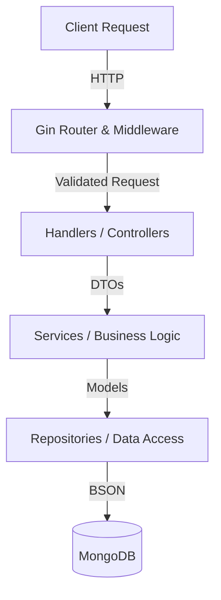

# Backend Architecture

The Pandal Hopping API follows a clear, layered, and modular architectural pattern in Go to ensure separation of concerns, maintainability, and scalability. This document provides an overview of the system design, the role of each layer, and the lifecycle of a typical request.

## High-Level Architecture

The backend is built with **Go** and uses the **Gin** HTTP web framework for routing and middleware management. For data persistence, it relies on **MongoDB**, communicating via the official Go driver. The application is containerized using Docker to ensure consistent execution environments.

### Core Technologies
- **Language**: Go 1.25+
- **HTTP Framework**: Gin (v1.11)
- **Database**: MongoDB (v1.17 driver)
- **Authentication**: JWT (JSON Web Tokens) with standard access/refresh token flow
- **Containerization**: Docker (Multi-stage build, target: `scratch`)

## Design Pattern

The application adopts the **Controller-Service-Repository** pattern (also often referred to as N-tier or Clean Architecture). This strictly separates the business logic, the data access, and the HTTP request handling.

### 1. Delivery Layer (`internal/handlers`, `internal/routes`, `internal/middleware`)
This layer is responsible for handling incoming HTTP requests, route definitions, and the initial validation of inputs.
- **Routes (`internal/routes`)**: Defines the HTTP endpoints and maps them to their respective handlers.
- **Middleware (`internal/middleware`)**: Handles cross-cutting concerns such as checking the `Authorization` standard Bearer token header, extracting the user ID from the JWT, and injecting it into the request context.
- **Handlers (`internal/handlers`)**: Reads query parameters, parses JSON bodies into structs, calls the associated service methods, and writes the JSON response (or error) back to the client.

### 2. Business Logic Layer (`internal/services`)
This layer encapsulates the core business rules of the application.
- It orchestrates the flow of data between handlers and repositories.
- **Examples**: Checking if a user's password is correct, generating JWTs, enforcing the rule that a user can only approve a pandal once, and determining when a pandal's status switches from `pending` to `approved` based on the configured approval count threshold.

### 3. Data Access Layer (`internal/repository`)
This layer strictly handles all database operations. It abstracts the MongoDB interactions from the rest of the application.
- All MongoDB queries, updates, insertions, and aggregation pipelines are defined here.
- The service layer simply calls these methods without needing to be aware of the underlying MongoDB specifics.

### 4. Data Models (`internal/models`)
This folder contains the Go structs representing the entities (e.g., `User`, `Pandal`) and the data transfer objects (DTOs) used throughout the system. These models dictate the shapes of BSON documents stored in the database as well as JSON payloads sent to the frontend.

## Key Mechanisms & Workflows

### 1. Application Startup & Graceful Shutdown
The application entry point is `cmd/server/main.go`. Upon starting:
1. Environment variables are loaded.
2. The MongoDB connection is established.
3. Database migrations (`internal/migrations`) are executed automatically (e.g., ensuring the `2dsphere` geospatial index is properly created on the `location` field for the pandals collection).
4. Dependencies are injected: Repositories are injected into Services, which are injected into Handlers.
5. The Gin HTTP server starts.

The server listens for OS interrupt signals (e.g., `SIGTERM`). When a termination signal is received, the server stops accepting new requests and is given a 5-second graceful shutdown window to finish processing in-flight requests and cleanly close the database connection.

### 2. Approval System Workflow
The approval system operates strictly through the service layer:
1. The user requests to approve a pandal (`PUT /pandals/:id/approve`).
2. The `PandalService` verifies the user hasn't already approved the pandal by checking the `approvedBy` array.
3. If valid, the repository increments `approvalCount` and pushes the User ID to `approvedBy`.
4. If `approvalCount` reaches the `REQUIRED_APPROVALS` environment variable threshold, the status transitions to `approved`.

### 3. Geospatial Features
By using MongoDB's `2dsphere` index natively, the backend structure enables efficient region-based queries. The schema defines locations as GeoJSON Point objects (`[longitude, latitude]`), allowing the repository layer to perform proximity-based searches.

### 4. Deployment Architecture
The backend is crafted to be extremely lightweight. The `Dockerfile` uses a multi-stage build:
1. Compiles the statically linked Go executable along with CA certificates for external requests.
2. Moves only the binary and certificates into an empty `scratch` image.
This brings the payload size down to merely a few megabytes and thoroughly minimizes the security attack surface.
